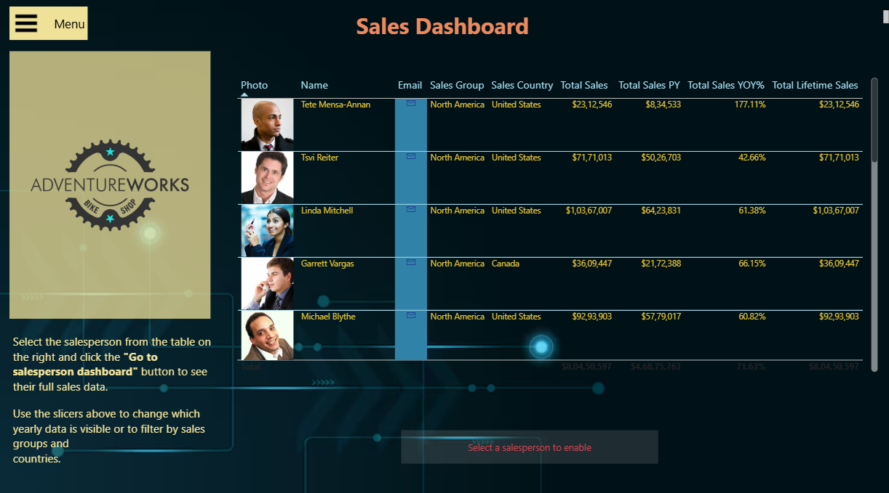

# 📊 AdventureWorks Data Analysis Dashboard

This project presents an **interactive Power BI dashboard** built on the AdventureWorks dataset. It demonstrates advanced data modeling, DAX calculations, and visualization techniques to deliver actionable insights for business decision-making.  

🔗 **Live Demo / Report**: [https://github.com/Maradani-Ratnakarun/Adventure-works-Sales-Analysis-Dashboard/blob/main/AdventureWorksdb.pbix]  
🔗 **GitHub Repository**: [https://github.com/Maradani-Ratnakarun/Adventure-works-Sales-Analysis-Dashboard]  

---

## 🚀 Project Overview

The dashboard was developed to analyze AdventureWorks company data, covering **sales performance, employee details, and regional trends**. It utilizes features like **Star Schema data modeling**, **DAX measures**, **Bookmarks**, **Buttons**, and **Drillthrough pages** for a highly interactive user experience.

---

## 🛠️ Features

### 🌟 Page 1: Main Dashboard
- ✅ **AdventureWorks Logo** for branding.
- ✅ **Employee Details Table** with images and key details.
- ✅ **Menu Bar with Slicers** for dynamic filtering:
  - Department
  - Job Title
  - Region
  - Year
- ✅ **Bookmarks & Buttons** to toggle between views seamlessly.

### 🌟 Page 2: Drillthrough Dashboard
- ✅ **Employee-specific Analytics**:
  - Cards displaying:
    - Employee Name
    - Job Title
    - Phone
    - Region
    - Total Lifetime Sales
  - 📌 **Bullet List** showing Year-over-Year (YoY) sales performance.
  - 📌 **Table** summarizing Yearly Sales.
  - 📌 **Matrix** for:
    - Top Producing Regions/Resellers
    - Top Selling Products
  - 📌 **Area Chart** depicting cumulative monthly sales.
  - 📌 YoY visual comparisons to identify trends and anomalies.

---

## 🏗️ Technical Architecture

### 📡 Data Source
- Connected to **SQL Server** hosting the AdventureWorks database.
- Imported tables:
  - Sales
  - Human Resources
  - Products
  - Geography
  - Resellers

### 🗄️ Data Modeling
- Designed a **Star Schema** for optimized querying.
- Established relationships between fact and dimension tables.

### 📐 DAX Measures
- Created calculated measures for:
  - Total Sales
  - Profit Margin
  - Year-over-Year (YoY) Growth
  - Cumulative Monthly Sales
  - Top N Products/Regions

### 🖱️ Interactivity
- Used **Bookmarks** and **Buttons** for a menu-driven user experience.
- Added **Drillthrough capabilities** to deep dive into individual employee performance.

---

## 📷 Screenshots

### 🏠 Main Dashboard  


### 📊 Drillthrough Dashboard  


---

## 📦 Tools & Technologies
- **Power BI Desktop**
- **Power Query** for ETL operations
- **DAX (Data Analysis Expressions)**
- **SQL Server** (AdventureWorks Database)
- Bookmarks & Buttons
- Drillthrough Pages

---

## 📝 How to Use

1. Clone this repository:
   ```bash
   git clone https://github.com/Maradani-Ratnakarun/Adventure-works-Sales-Analysis-Dashboard.git

1. Open AdventureWorks-Dashboard.pbix in Power BI Desktop.

2. Update SQL Server connection settings in Transform Data (Power Query) to point to your local or remote server.

3. Refresh data to load the latest AdventureWorks dataset.

4. Publish to Power BI Service (optional) to share with stakeholders.

📚 Learning Outcomes
Mastered Power BI’s data modeling and visualization capabilities.

Leveraged advanced DAX functions for dynamic KPIs and calculations.

Designed multi-page dashboards with smooth navigation using bookmarks & buttons.

Enabled employee-level drillthrough analysis for actionable insights.

✨ Highlights
📌 Connected AdventureWorks database via SQL Server.

📌 Built star schema relationships for optimized performance.

📌 Used dynamic measures and slicers for tailored insights.

📌 Implemented advanced interactivity with bookmarks, buttons, and drillthrough.

📌 Created professional and clean visualizations for executive-level reporting.

🔗 Useful Links
AdventureWorks Database Docs

Power BI Official Docs

📣 Author
👤 Your Name
📧 your.email@example.com
🔗 LinkedIn Profile
🔗 GitHub Profile


